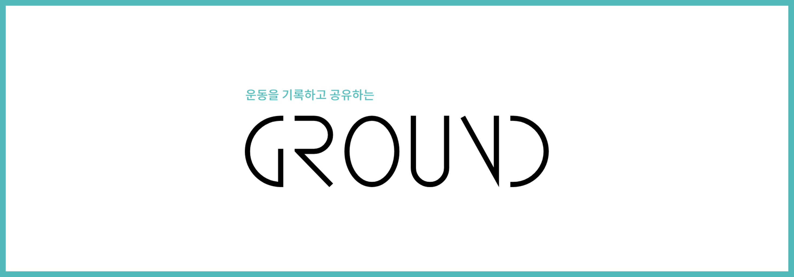
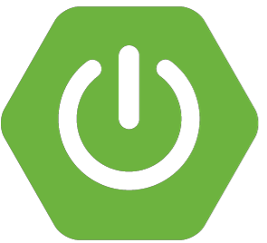
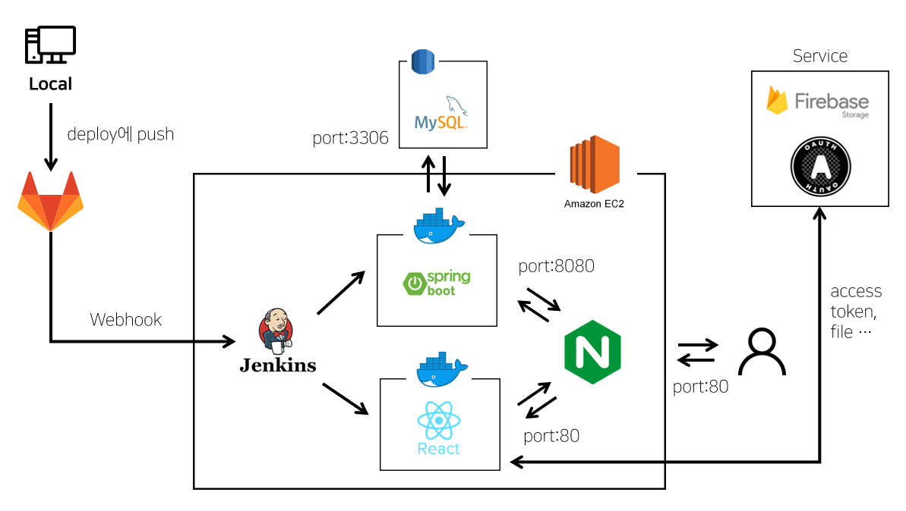

<div align="center">
  
  <br />
</div>

<br />

# 목차
1. [**웹 서비스 소개**](#1)
2. [**주요 기능**](#2)
3. [**기술 스택**](#3)
4. [**프로젝트 구성도**](#4)
5. [**실행 방법**](#5)
6. [**팀 소개**](#6)

<br />

<div id="1"></div>

# 웹 서비스 소개
**그라운드(GROUND)** 는 개인의 운동 경험을 기록할 수 있고 공유할 수 있는 SNS입니다.  

인스타그램에서 오늘 운동 완료를 뜻하는 `#오운완` 해시태그를 통해 운동 인증을 하는 사람을 종종 볼 수 있습니다. 저희는 개인에게 운동에 대한 동기 부여를 더 확실히 해줄 수 있는 방법에 대해 고민하게 되었습니다.

이에 대해 Github와 GitLab에 있는 contribution graph에서 영감을 얻어, 운동 인증 게시글 작성을 하면 개인의 운동 캘린더에 기록하고 개인의 운동 통계를 제공함으로써 지속적으로 운동을 할 수 있도록 장려하고 있습니다.

뿐만 아니라, 게시글을 다른 사람과 공유해서 원하는 운동 정보를 얻고 소통할 수 있도록 게시글만 모아볼 수 있는 피드도 제공하고 있습니다.

<br />

<div id="2"></div>

# 주요 기능
1. 팔로우 피드
   - 현재 팔로우를 하고 있는 사용자들의 게시글만 모아볼 수 있는 피드
2. 최신글 피드
   - 모든 사용자가 올린 게시글을 볼 수 있는 피드
   - 관심 운동 종목 설정해서 원하는 게시글만 필터링 가능
3. 검색
   - 유저, 게시글 검색
   - 게시글 검색할 때 날짜, 운동 종목 등의 필터 적용
4. 나의 운동장
   - 게시글을 올리면 그 날에 대한 운동 기록이 남음
   - 최근 운동 종목, 이 때까지 한 운동에 대한 통계 제공(게시글 카테고리 기준)
5. 알림
   - 활동 탭에서 나의 게시글에 달린 댓글, 좋아요 등의 알림을 받을 수 있음
   - 계정 탭에서 팔로우 요청, 내가 요청한 팔로우 수락 여부 등을 확인할 수 있음

<br />

<div id="3"></div>

# 기술 스택
## Frontend
|  |  |  |
| :-: | :-: | :-: |
|HTML|CSS|Javascript|


|  |  |  |  ||
| :-: | :-: | :-: | :-: | :-: |
|React|Redux|Sass|MUI|Firebase|


<br />

## Backend
|  |  |  |  | 
| :-: | :-: | :-: | :-: |
|Java|Spring Boot|JWT|Swagger|

| |  |  |
|:-:| :-: | :-: |
|JPA Hibernate|AWS RDS|MySQL|

<br />

## CI/CD
||||
|:-:|:-:|:-:|:-:|
|AWS EC2|Jenkins|Docker|Nginx|

<br />

<div id="4"></div>

# 프로젝트 구성도


<br />

<div id="5"></div>

# 실행 방법
## 프로젝트 클론
```
git clone https://lab.ssafy.com/s07-webmobile2-sub2/S07P12D103.git
```
## client 실행
- 프로젝트의 frontend 디렉토리
1. 환경 변수 설정
   - 카카오 및 구글 OAuth, firebase를 사용하기 때문에 해당 기능을 이용하려면 API 키를 개인적으로 발급받아야 함
   - .env 파일 생성 후 발급받은 API키를 다음과 같이 입력
  ```sh
  # 카카오 로그인
  REACT_APP_KAKAO_REST_API_KEY=발급받은 키 값
  REACT_APP_KAKAO_REDIRECT_URI=발급받은 키 값
  # 구글 로그인
  REACT_APP_GOOGLE_CLIENT_ID=발급받은 키 값
  REACT_APP_GOOGLE_REDIRECT_URI=발급받은 키 값
  # 파이어베이스
  REACT_APP_FB_API_KEY=발급받은 키 값
  REACT_APP_FB_AUTH_DOMAIN=발급받은 키 값
  REACT_APP_FB_PROJECT_ID=발급받은 키 값
  REACT_APP_FB_STORAGE_BUCKET=발급받은 키 값
  REACT_APP_FB_MESSAGE_ID=발급받은 키 값
  REACT_APP_FB_APP_ID=발급받은 키 값
  ```
2. 실행
  ```
  npm install
  npm start
  ```

<br />

## server 실행
- 프로젝트의 backend/ground 디렉토리
1. 프로젝트 실행을 위한 yml 파일 설정
  ``` yml
  spring:
    mail:
      host: smtp.gmail.com
      port: 587
      username: [Gmail 사용자 계정]
      password: [Gmail 사용자 비밀번호]
      properties:
        mail:
          smtp:
            auth: true
            starttls:
              enable: true
              
    datasource:
      url: [DB url]
      username: [사용자명]
      password: [비밀번호]
      driver-class-name: com.mysql.cj.jdbc.Driver

    jpa:
      hibernate:
        ddl-auto: update
      properties:
        show_sql: true
        hibernate:
        format_sql: true
      database: mysql
    
    mvc:
      pathmatch:
        matching-strategy: ANT_PATH_MATCHER
      
  jwt:
    secret: [비밀키]
    token-validity-in-seconds: [토큰 유지 시간]
    # 60000 -> 1분
      
  kakao:
    client_id: [카카오 로그인 API 키]
    redirect_uri: [카카오 로그인 리다이렉트 URI]
    
  google:
    auth_url: https://accounts.google.com/o/oauth2/v2/auth
    token_url: https://oauth2.googleapis.com/token
    redirect_uri: [구글 로그인 리다이렉트 URI]
    client_id: [발급 받은 키]
    client_secret: [발급 받은 키]

  logging.level:
    org.hibernate.SQL: debug
  ```
2. clean 으로 기존 jar 파일 삭제
3. bootJar 으로 현제 버전 jar 파일 생성  

4. [Shift + F10] run 실행

<br />

<div id="6"></div>

# 팀 소개
|이름|김주영|배시현|박종욱|박주현|조인후|한유빈|
|:-:| :---: | :---: | :---: | :---: | :---: | :---: |
|프로필|||||||
|포지션|Frontend & UI/UX <br /> 영상편집|Backend|Backend|Backend & CI/CD|Frontend & UI/UX|**팀장**<br />Frontend & UI/UX|

